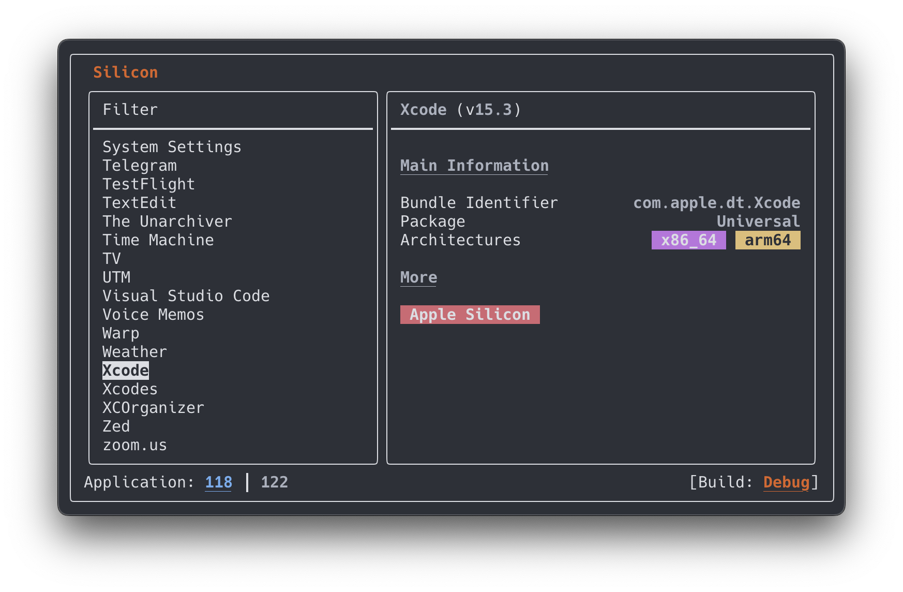
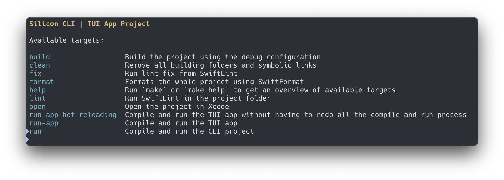

# Silicon

Silicon is a Swift Package built upon the core technology of the [Silicon app](https://github.com/DigiDNA/Silicon), a product of [DigiDNA](https://www.digidna.net).

This tool was originally designed to expose only an API using CLI to other apps via JSON format. However, due to my own interest in expanding it, I've decided to also play a bit more and create a TUI (_Terminal User Interface_) version of it. With that, now you can also see the list of apps in Plain Text, JSON Format but also in a full Terminal app. The original library is still there to be used, just need to add this repo as dependency and import `SiliconLibrary`.

## CLI

This tool is designed to provide users with valuable information about the applications on their macOS systems, with a particular focus on app architecture.

To illustrate, here's a sample of the output you can expect from this CLI:

```shell
$ ./silicon-cli --json
```

Result

```json
{
  "applications": [
    {
      "architecture": "Apple",
      "architectures": [
        "arm64"
      ],
      "bundleIdentifier": "co.teamport.around",
      "isAppleSilicon": true,
      "isSystemApp": false,
      "name": "Around",
      "path": "/Applications/Around.app",
      "version": "0.60.46",
      "isElectronApp" : true
    },
    {
      "architecture": "Intel 64",
      "architectures": [
        "x86_64"
      ],
      "bundleIdentifier": "com.krill.Patterns",
      "isAppleSilicon": false,
      "isSystemApp": false,
      "name": "Patterns",
      "path": "/Applications/Patterns.app",
      "version": "1.2",
      "isElectronApp" : false
    },
    {
      "architecture": "Universal",
      "architectures": [
        "x86_64",
        "arm64"
      ],
      "bundleIdentifier": "com.apple.dt.Xcode",
      "isAppleSilicon": true,
      "isSystemApp": false,
      "name": "Xcode",
      "path": "/Applications/Xcode.app",
      "version": "13.3.1",
      "isElectronApp" : false
    }
  ],
  "total": 3
}
```

## TUI App

The app is quite functional, but still very simple and without too many features. In case you like it, pull requests are very welcome.

Features implemented (so far):

- [x] List of apps
- [x] Filter by four categories (Silicon, Intel, System, and Electron)
- [x] Details of the apps

To Do:
- [ ] Search apps by text
- [ ] Open an app
- [ ] Uninstall an app
- [ ] Create a target on Makefile to install `silicon` and `silicon-cli`

To use, just run in the root of the project

```shell
make run-app
```


## System Requirements

- Swift 5.9 or newer
- [FSWatch](https://emcrisostomo.github.io/fswatch/)

## Compile and run

```shell
$ git clone https://github.com/unnamedd/SiliconCLI.git
$ cd SiliconCLI
$ make run
```
It is provided some very useful targets in the Makefile, just run
```shell
$ make
# or
$ make help
```



## Author

Silicon CLI and TUI App was developed and is maintained by [Thiago Holanda](https://twitter.com/tholanda).

## Acknowledgements

- [`Silicon app`](https://github.com/DigiDNA/Silicon) by [DigiDNA](https://github.com/DigiDNA)
- [`SwiftTUI`](https://github.com/rensbreur/SwiftTUI) by [Rens Breur](https://github.com/rensbreur)

## License

Silicon CLI and TUI App is available under the [MIT License](http://opensource.org/licenses/MIT).
You can find all the necessary details in the [LICENSE](LICENSE) file.
